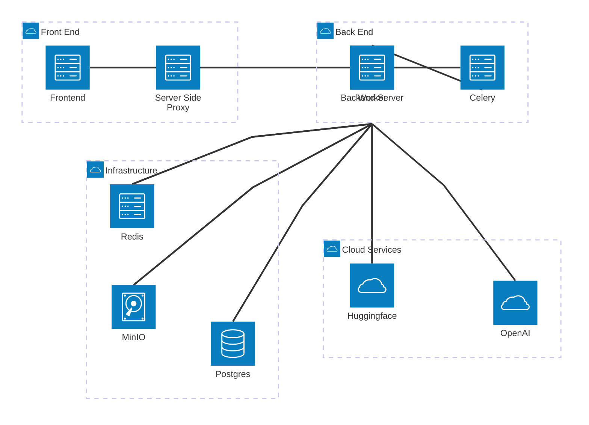

```mermaid

architecture-beta
    group frontend(cloud)[Front End]
    group backend(cloud)[Back End]
    group infrastructure(cloud)[Infrastructure]
    group cloud(cloud)[Cloud Services]

    service vuejs(server)[Frontend] in frontend
    service proxy(server)[Server Side Proxy] in frontend

    service fastapi(server)[Backend Server] in backend
    service worker(server)[Worker] in backend

    service postgres(database)[Postgres] in infrastructure
    service minio(disk)[MinIO] in infrastructure
    service redis(server)[Redis] in infrastructure
    service celery(server)[Celery] in backend

    service openai(cloud)[OpenAI] in cloud
    service huggingface(cloud)[Huggingface] in cloud

    vuejs:R -- L:proxy
    proxy:R -- L:fastapi

    fastapi:R -- L:celery
    celery:B -- T:worker

    fastapi{group}:B -- T:redis
    fastapi{group}:B -- T:postgres
    fastapi{group}:B -- T:minio

    fastapi{group}:B -- T:openai
    fastapi{group}:B -- T:huggingface

    worker{group}:B -- T:redis
    worker{group}:B -- T:postgres
    worker{group}:B -- T:minio

    worker{group}:B -- T:huggingface

```
